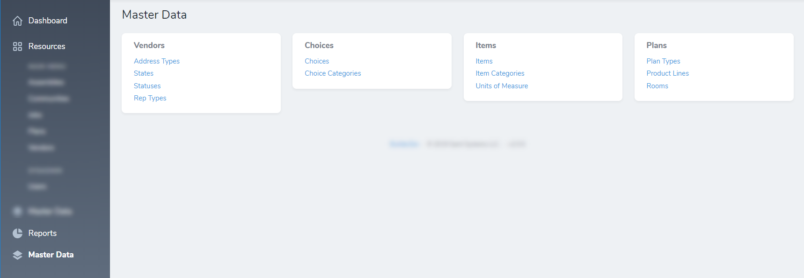

# Nova Resource Group Menu

[](https://packagist.org/packages/saintsystems/nova-resource-group-menu)
[](https://packagist.org/packages/saintsystems/nova-resource-group-menu)

Give large resource groups their own menu pages with sub-groups.




## Installation

You can install the package in to a Laravel app that uses [Nova](https://nova.laravel.com) via composer:

```bash
composer require saintsystems/nova-resource-group-menu
```

## Usage

To enable resource group menu pages add the `DisplaysInResourceGroupMenu` trait to your base Nova `Resource`.
```php
// in your app/Nova/Resource.php class
use SaintSystems\Nova\ResourceGroupMenu\DisplaysInResourceGroupMenu;

abstract class Resource extends NovaResource
{
    use DisplaysInResourceGroupMenu;

    //... Removed for brevity

}

```
Then, within your Nova Resources that you want to group and place on their own resource group menu page, ensure the following:

1. Set `$displayInNavigation` to `false`:
```php
// in your Nova Resource classes
public static $displayInNavigation = false;
```

2. Define a group for the resource:
```php
// in your Nova Resource classes
public static $group = 'Master Data';
```
3. Define a sub-group for the resource:
```php
// in your Nova Resource classes
public static $subGroup = 'Vendors';
```

Finally, register the tool in your `NovaServiceProvider` like so:
```php
    use SaintSystems\Nova\ResourceGroupMenu\ResourceGroupMenu;

    /**
    * Get the tools that should be listed in the Nova sidebar.
    *
    * @return array
    */
    public function tools()
    {
        return [
            new SaintSystems\Nova\ResourceGroupMenu\ResourceGroupMenu
        ];
    }
```

Optionally, define custom icons to use for each Resource Menu Group

```php
/**
     * Get the tools that should be listed in the Nova sidebar.
     *
     * @return array
     */
    public function tools()
    {
        return [
            (new ResourceGroupMenu)->withMeta([
                'group_icons' => [
                    'Master Data' => '<svg class="sidebar-icon" viewBox="0 0 20 20" version="1.1" xmlns="http://www.w3.org/2000/svg" xmlns:xlink="http://www.w3.org/1999/xlink"><g id="Page-1" stroke="none" stroke-width="1" fill="none" fill-rule="evenodd"><g id="icon-shape"><path fill="var(--sidebar-icon)" d="M10,1 L20,7 L10,13 L0,7 L10,1 Z M16.6666667,11 L20,13 L10,19 L0,13 L3.33333333,11 L10,15 L16.6666667,11 Z" id="Combined-Shape"></path></g></g></svg>',
                    'Reports' => '<svg class="sidebar-icon" viewBox="0 0 20 20" version="1.1" xmlns="http://www.w3.org/2000/svg" xmlns:xlink="http://www.w3.org/1999/xlink"><g id="Page-1" stroke="none" stroke-width="1" fill="none" fill-rule="evenodd"><g id="icon-shape"><path fill="var(--sidebar-icon)" d="M19.9506248,11 C19.4489003,16.0533227 15.1853481,20 10,20 C4.4771525,20 0,15.5228475 0,10 C0,4.8146519 3.94667731,0.551099672 9,0.0493752426 L9,11 L19.9506248,11 L19.9506248,11 Z M19.8726884,8.4 C19.1906421,4.15869069 15.8413093,0.809357943 11.6,0.127311599 L11.6,8.4 L19.8726884,8.4 Z" id="Combined-Shape"></path></g></g></svg>',
                ],
            ]),
        ];
    }
```

## Credits

- [Adam Anderly](https://github.com/anderly)
- [Saint Systems](https://github.com/saintsystems)
- [All Contributors](../../contributors)

## License

The MIT License (MIT). Please see [License File](LICENSE.md) for more information.
